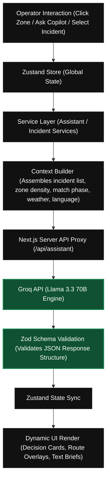

<!--
  VenueMind AI - README.md
  Premium Redesign for FIFA World Cup 2026 Smart Stadiums & Tournament Operations Hackathon.
  This document is the official entry overview.
-->

<div align="center">

# 🏟️ VenueMind AI

### **GenAI-Powered Stadium Operations Command Center**

**Built for the FIFA World Cup 2026 — Smart Stadiums & Tournament Operations Challenge**

_One unified AI reasoning engine. Every operational decision, in real time._

[](https://venue-mind-ai.vercel.app/)
[](https://github.com/rahulasthwik1307/VenueMind-AI)

<br/>

[](https://nextjs.org)
[](https://www.typescriptlang.org)
[](https://groq.com)
[](https://github.com/pmndrs/zustand)
[](https://tailwindcss.com)
[](https://www.framer.com/motion/)
[](https://zod.dev)
[](https://vitest.dev)

---

### [Explore Live Demo »](https://venue-mind-ai.vercel.app/) · [Platform Walkthrough](#-platform-walkthrough) · [Interactive Digital Twin](#%EF%B8%8F-interactive-stadium-digital-twin-centerpiece) · [AI Architecture](#%EF%B8%8F-ai-reasoning-architecture) · [Getting Started](#%EF%B8%8F-getting-started)

</div>

---

## 📖 Table of Contents

- [🎯 Mission](#-mission)
- [✨ Quick Highlights](#-quick-highlights)
- [📊 Project at a Glance](#-project-at-a-glance)
- [📖 Executive Summary](#-executive-summary)
- [🎯 Challenge Alignment](#-challenge-alignment)
- [🚨 The Problem & Why GenAI](#-the-problem--why-genai)
  - [🔄 Comparison Matrix](#-comparison-matrix)
  - [🔄 Why VenueMind AI is Different](#-why-venuemind-ai-is-different)
- [🗺️ Interactive Stadium Digital Twin (Centerpiece)](#%EF%B8%8F-interactive-stadium-digital-twin-centerpiece)
- [🧠 AI Reasoning Architecture](#-ai-reasoning-architecture)
- [🧭 Platform Walkthrough](#-platform-walkthrough)
  - [1. Dashboard (The Nerve Center)](#1-dashboard-the-nerve-center)
  - [2. Live Incidents Console](#2-live-incidents-console)
  - [3. AI Command Center](#3-ai-command-center)
  - [4. Stadium Digital Twin View](#4-stadium-digital-twin-view)
  - [5. Crowd Monitoring Lens](#5-crowd-monitoring-lens)
  - [6. Transport Monitoring Lens](#6-transport-monitoring-lens)
  - [7. Emergency Monitoring Lens](#7-emergency-monitoring-lens)
  - [8. Accessibility Monitoring Lens](#8-accessibility-monitoring-lens)
  - [9. Operations Timeline (Flight Recorder)](#9-operations-timeline-flight-recorder)
  - [10. Settings Hub](#10-settings-hub)
- [🔄 Match Day Operational Flow Timeline](#-match-day-operational-flow-timeline)
- [✨ Feature Showcase](#-feature-showcase)
- [🛠️ Engineering Highlights](#%EF%B8%8F-engineering-highlights)
- [📂 Project Structure](#-project-structure)
- [🧰 Technology Stack](#-technology-stack)
- [🔒 Security, Accessibility & Testing](#-security-accessibility--testing)
  - [Security Domain Matrix](#security-domain-matrix)
  - [Accessibility Implementation](#accessibility-implementation)
  - [Testing Strategy](#testing-strategy)
- [⚠️ Assumptions & Future Roadmap](#%EF%B8%8F-assumptions--future-roadmap)
  - [Core Assumptions](#core-assumptions)
  - [Future Roadmap](#future-roadmap)
- [🏁 Submission Readiness](#-submission-readiness)
- [🚀 Getting Started](#-getting-started)
  - [Prerequisites](#prerequisites)
  - [Installation](#installation)
  - [Verification](#verification)
- [📸 Screenshot Gallery](#-screenshot-gallery)

---

## 🎯 Mission

During a FIFA World Cup match, thousands of operational decisions must happen within seconds. VenueMind AI exists to transform complex, high-velocity operational data into structured, AI-assisted decisions—empowering stadium operators to respond faster, safer, and more intelligently when every second counts.

---

## ✨ Quick Highlights

- **✓ AI-powered Stadium Operations** — Cognitive decision-support for venue staff.
- **✓ Interactive Stadium Digital Twin** — Custom React SVG visual mapping of zones & gates.
- **✓ Real-Time Incident Intelligence** — Multi-incident parsing and situation briefings.
- **✓ Crowd Management** — Dynamic density heatmap overlays and gate diversion suggestions.
- **✓ Accessibility Dispatch** — Tactical Accessibility Dispatch Tool generating mobility routes.
- **✓ Transport Intelligence** — Transit hub wait-time analytics synced with egress surges.
- **✓ Emergency Operations** — Rapid safety routes and evacuation guidance.
- **✓ Multilingual AI** — Structured recommendations localizable in EN, ES, FR, PT, and HI.
- **✓ Operational Timeline** — Session "flight recorder" logging all events and resolutions.
- **✓ Match Simulation** — In-memory 6-phase simulation engine replicating live stadium telemetry.
- **✓ Decision Support** — Actionable decision cards detailing impact, risk, and confidence.
- **✓ Production Architecture** — Server-side API proxies, Zod schema validation, and Zustand state.

---

## 📊 Project at a Glance

| Metric / Attribute              | Value / Specification                                                                                                        |
| :------------------------------ | :--------------------------------------------------------------------------------------------------------------------------- |
| **Operational Workspaces**      | 10 Dedicated Modules (Dashboard, Incidents, AI Command, Map, Crowd, Transport, Emergency, Accessibility, Timeline, Settings) |
| **Core AI Reasoning Engine**    | 1 Shared Groq Llama 3.3 70B Interface                                                                                        |
| **Stadium Interface Map**       | 1 Custom-Engineered Interactive React SVG Digital Twin                                                                       |
| **Match Day Simulation Phases** | 6 Sequential Operational Phases (Pre-Match ➔ Post-Match)                                                                     |
| **Test Quality Verification**   | 144 Passing Unit Tests (Vitest)                                                                                              |
| **Multilingual AI Interface**   | 5 Languages Supported (English, Spanish, French, Portuguese, Hindi)                                                          |
| **Type Safety Standard**        | 100% Strict TypeScript (No `any`)                                                                                            |
| **Accessibility Compliance**    | WCAG AA Minimum Standard (Aria-live, Reduced Motion, Key Focus)                                                              |
| **Input/Output Safety**         | Strict Zod Schema Validation                                                                                                 |
| **Design Integrity**            | Production-Ready SaaS Console Architecture                                                                                   |

---

## 📖 Executive Summary

**VenueMind AI** is a real-time stadium operations intelligence console engineered for the venue managers, security coordinators, transport dispatchers, and volunteer leads running a FIFA World Cup 2026 stadium. Rather than stretching resources across multiple disconnected consumer-facing personas, VenueMind AI goes deep on a single mission-critical user group: **stadium operations staff**.

Powered by a central Groq-enabled Llama 3.3 70B reasoning engine, the platform transforms raw, simulated IoT telemetry and dynamic incident feeds into schema-validated tactical recommendations, safety-optimized routes, and consolidated incident briefs. It replaces traditional passive monitoring dashboards with **proactive, reasoning-based operational decision support**, ensuring that every operational surface shares the same underlying intelligence.

---

## 🎯 Challenge Alignment

VenueMind AI was built specifically to address the **Smart Stadiums & Tournament Operations** track. By choosing to focus entirely on the _venue staff and tournament organizer_ persona, we developed a production-ready, deep platform rather than a shallow, split-focus app.

Here is how VenueMind AI directly addresses the challenge criteria:

| Challenge Pillar                | Actual Implemented Functionality                                                                                                                      | Impact on Stadium Operations                                                                             |
| :------------------------------ | :---------------------------------------------------------------------------------------------------------------------------------------------------- | :------------------------------------------------------------------------------------------------------- |
| **Operational Intelligence**    | Custom AI Command Center with structured briefing modes (incident, zone, domain) and free-form query analysis.                                        | Resolves operator fatigue by synthesizing complex data into direct, actionable situational briefs.       |
| **Real-Time Decision Support**  | Dynamic "Decision Cards" featuring situation summaries, safety reasoning, risk assessments, confidence scores, and instant dispatch commands.         | Reduces the time between incident detection and staff deployment from minutes to seconds.                |
| **Crowd Management**            | Real-time crowd density SVG heatmap overlays, zone capacity tracking, and crowd-crush prevention routing.                                             | Proactively routes crowds away from bottleneck gates before overcrowding occurs.                         |
| **Accessibility Support**       | The **Tactical Accessibility Dispatch Tool** generates specialized step-by-step routing utilizing elevators, ramps, and volunteer assistance.         | Guarantees that disabled or mobility-challenged fans receive fast, tailored accommodation routing.       |
| **Transportation Intelligence** | Transport monitoring lens merging live transit hub status (metro, bus, shuttle, walking, rideshare) with stadium gate exits.                          | Auto-suggests route adjustments and transit dispatch boosts based on live outbound passenger surges.     |
| **Multilingual Assistance**     | Localization dropdown rendering AI briefings and dispatch recommendations in **English, Spanish, French, Portuguese, or Hindi**.                      | Facilitates seamless communication across a diverse, multinational volunteer and staff team.             |
| **Tournament Operations**       | In-memory Match-Day Simulation Engine driving telemetry and incidents through 6 sequential phases, logged in a persistent "flight recorder" timeline. | Provides a fully interactive environment that proves the architecture is ready to ingest real IoT feeds. |

### 🎯 Challenge Coverage Summary

- **✓ Operational Intelligence** — Real-time reasoning-based situational awareness.
- **✓ Real-Time Decision Support** — Executable decision cards with risk & impact scoring.
- **✓ Crowd Management** — SVG heatmap overlays showing live zone density telemetry.
- **✓ Transportation** — Transit hub frequency analytics integrated with fan egress volumes.
- **✓ Accessibility** — Special navigation routing avoiding obstacles (ramps, elevators).
- **✓ Multilingual Assistance** — Translates incident briefs and recommendations into 5 languages.
- **✓ Tournament Operations** — Logs every event chronologically in a global timeline.
- **✓ Venue Staff** — Dedicated completely to the operators, coordinators, and directors.
- **✓ Stadium Operators** — Designed for high-stress command center environments.
- **✓ AI-powered Decision Support** — Validated by Zod, schema-secured Groq Llama 3.3.

---

## 🚨 The Problem & Why GenAI

### The Problem: Dashboard Overload & Operational Fatigue

Running a World Cup stadium means absorbing a constant, high-velocity stream of operational signals—crowd density shifting at Gate A, a medical call in Sector 104, a delayed metro train, and a volunteer radio request.

- **Traditional tools are "passive monitoring-first."** They present charts, counts, and flashing red lights, but leave the cognitive load of triaging, connecting the dots, and determining the appropriate response entirely on an overloaded operator.
- **Minutes cost lives.** During high-pressure scenarios (e.g., crowd congestion at a gate during a sudden storm), decision fatigue leads to delayed or incorrect dispatches.

### Why Generative AI is Required

Generative AI, when integrated as an **underlying reasoning layer**, shifts the paradigm from monitoring-first to **decision-support-first**.

- **Contextual Correlation:** The AI doesn't just display a transport delay and a gate bottleneck as separate entries; it correlates them, recognizing that the metro delay is causing fans to cluster at Gate A, and recommends shifting entry gates.
- **Justified Recommendations:** Rather than a black-box suggestion, the AI outputs its reasoning, risk assessments, and impact predictions, allowing the operator to verify and dispatch resources with high confidence.
- **Dynamic Safety Routing:** Static navigation cannot adapt to an active incident. The AI dynamically calculates routes avoiding high-density zones or active security events.

### 🔄 Comparison Matrix

| ❌ What Others Build                                                                                                 | ✅ What VenueMind AI Is                                                                                                        |
| :------------------------------------------------------------------------------------------------------------------- | :----------------------------------------------------------------------------------------------------------------------------- |
| **Shallow multi-persona apps**<br>Defaulting to consumer-facing fan apps or trying to cover four personas shallowly. | **One deep, production-grade product**<br>Dedicated entirely to a single persona: stadium operators and venue staff.           |
| **Monitoring-First Dashboards**<br>Interfaces that display raw data without reasoning or explaining the situation.   | **Decision-Support-First Console**<br>Actively interprets telemetry, predicts risk, and recommends justified tactical actions. |
| **Bolted-On Chatbots**<br>Simple chat widgets floating on top of standard CRUD views.                                | **Underlying AI Reasoning Engine**<br>A shared decision-support layer integrated directly into every operational surface.      |
| **Disconnected/Static Views**<br>Static mock data or isolated alerts that don't impact the rest of the application.  | **Unified Operational Flow**<br>All simulated IoT telemetry and AI actions feed into a persistent global timeline.             |

### 🔄 Why VenueMind AI is Different

| Typical Hackathon Solution    | VenueMind AI Command Console                                                            |
| :---------------------------- | :-------------------------------------------------------------------------------------- |
| **Generic Dashboard**         | **AI Decision Platform** (Synthesizes raw inputs into actionable decisions)             |
| **Simple Chatbot**            | **Context-Aware Operational Copilot** (Injects active screen/zone/incident context)     |
| **Static Map**                | **Interactive Digital Twin** (Optimized SVG with density heatmaps & routing paths)      |
| **Incident Monitoring**       | **AI Reasoning + Decision Support** (Risk, impact, and safety justification scoring)    |
| **Multiple Shallow Personas** | **Deep Stadium Operations Persona** (100% focused on stadium operators & staff)         |
| **Reactive Responses**        | **Predictive Intelligence** (Forecasts crowd crush and gate bottlenecks by phase)       |
| **Basic Data Feeds**          | **Operational Intelligence Engine** (Chronological global timeline logs all AI actions) |

---

## 🗺️ Interactive Stadium Digital Twin (Centerpiece)

The centerpiece of VenueMind AI is the custom-built **Interactive Stadium Digital Twin**. Rather than integrating heavy, generic third-party mapping libraries that fail to capture stadium-specific layers, the Digital Twin is built using **highly optimized React SVGs**.

```
                        🏟️ STADIUM DIGITAL TWIN LAYERS
 ┌─────────────────────────────────────────────────────────────────────────┐
 │  [Live Incident Indicators]   🚨 Flash on active zones                  │
 ├─────────────────────────────────────────────────────────────────────────┤
 │  [Dynamic SVG Route Overlays] 🟩 Standard  🟨 Accessibility  🟥 Emergency│
 ├─────────────────────────────────────────────────────────────────────────┤
 │  [Crowd Density Heatmaps]     🟩 Low  🟨 Medium  🟧 High  🟥 Critical   │
 ├─────────────────────────────────────────────────────────────────────────┤
 │  [Zone Geometries]            Interactive click-to-focus SVG Paths      │
 └─────────────────────────────────────────────────────────────────────────┘
```

### Key Capabilities & Architecture:

- **Vector-Based Performance:** Pure React SVG paths ensure zero layout layout-shift, hardware-accelerated rendering, and instantaneous responsiveness.
- **Precision Zoom & Pan:** Powered by `react-zoom-pan-pinch`, enabling operators to zoom from a bird's-eye tournament view down to individual gates, seating blocks, concession zones, and restrooms.
- **Real-Time Data Overlays:**
  - **Density Heatmap:** Individual zone paths dynamically interpolate their fill colors based on live telemetry crowd density values (`Low` ➔ `Critical`).
  - **Dynamic SVG Path Routing:** Renders custom polyline route overlays (Standard, Emergency, and Accessibility paths) generated by the routing engine.
  - **Live Incident Markers:** Renders real-time Lucide warning icon overlays anchored directly to the coordinates of active incidents.
- **Interactive Operations Panel:** Clicking any zone or incident on the SVG automatically pulls up its detailed telemetry, active incident lists, and triggers an immediate localized AI context briefing.

---

## 🧠 AI Reasoning Architecture

VenueMind AI operates on a single, shared reasoning pipeline. Every copilot, command panel, and dispatch tool communicates through the same server-side API, ensuring absolute architectural consistency and safety.



### Key Architecture Components:

1. **Dynamic Context Builder:** When a request is triggered, the context builder gathers the active Match Phase, Weather Conditions, selected Incident properties, and Zone Telemetry. This creates a dense, token-efficient state snapshot.
2. **Prompts Directory (`/src/prompts`):** Prompts are strictly separated from components. They consist of a structured **System Prompt** (establishing the Stadium Operator persona, tone, and safety rules), a **Persona Prompt** (custom rules for different operational domains), and **Templates** for structured JSON output.
3. **Zod Validation Shield:** The server-side proxy enforces strict Zod validation schemas (`/src/schemas`). If the LLM generates a response that violates the expected JSON schema, the app catches the error, falls back to a typed error, and triggers a clean UI error boundary without breaking the application state.
4. **Zustand Store Integration:** Once validated, the structured JSON payload updates the `assistantStore`, immediately reflecting in the UI through Framer Motion-guided transitions.

---

## 🧭 Platform Walkthrough

The platform contains ten operational workspaces covering the complete lifecycle of a FIFA World Cup match. Each workspace is specifically tailored to a core stadium operations role, ensuring seamless coordination, real-time decision support, and AI-enabled situational awareness during high-pressure tournament moments.

---

### 1. Dashboard (The Nerve Center)

- **Purpose:** Provides a high-level operational pulse of the stadium.
- **Primary Users:** Stadium Operations Director.
- **AI Capability:** Continuous background analysis of incoming telemetry to flag escalating patterns.
- **Operational Value:** Instant awareness of active incident count, average response times, current crowd safety levels, and weather impacts.
- **Key Widgets:** `CapacityWidget` (shows live gate entry totals), `ActiveIncidentsChart`, `StatusGrid`.
- **Platform Integration:** Feeds summary data to the map and updates store states.

---

### 2. Live Incidents Console

- **Purpose:** Centralized hub for triaging, reviewing, and resolving incidents.
- **Primary Users:** Security Dispatcher, Incident Commander.
- **AI Capability:**
  1. **Individual Triage:** Generates custom tactical recommendations and risks for a selected incident.
  2. **Consolidated Multi-Incident Briefing:** Analyzes multiple selected incidents together to identify root causes (e.g. realizing that an entrance delay at Gate B and crowd congestion at Sector 2 are correlated).
- **Operational Value:** Eliminates the chaos of handling isolated incidents by giving operators unified, AI-driven guidance.
- **Key Actions:** Multi-select triage, inline operational notes, dispatch timeline updates.

---

### 3. AI Command Center

- **Purpose:** Command prompt playground for natural language and structured operations.
- **Primary Users:** Operations Lead, Tournament Director.
- **AI Capability:** Dual-mode input.
  1. **Structured Mode:** Select an operational domain, zone, and language to fetch a structured status assessment.
  2. **Free-form Mode:** Chat naturally to query details like: _"What is the evacuation route for Sector 102 if Gate C is blocked?"_
- **Operational Value:** Serves as the interactive brain of the console, converting questions into actionable decision cards.

---

### 4. Stadium Digital Twin View

- **Purpose:** Geographical monitoring and visual routing.
- **Primary Users:** Ground Command, Security Patrols.
- **AI Capability:** Calculates dynamic paths around bottlenecks and projects safety routes.
- **Operational Value:** Enables operators to visual-map active situations rather than looking at spreadsheet-like databases.
- **Key Actions:** Toggle SVG layers (zones, gates, accessibility, routes), zoom-to-incident.

---

### 5. Crowd Monitoring Lens

- **Purpose:** Density tracking and crowd-crush prevention.
- **Primary Users:** Crowd Control Officers, Safety Coordinators.
- **AI Capability:** Analyzes flow rates and crowd density telemetry to forecast potential bottlenecks.
- **Operational Value:** Prevents stampedes and critical gate congestion by recommending proactive diversions.
- **Key Cards:** `CrowdDensityCard` showing real-time density by sector.

---

### 6. Transport Monitoring Lens

- **Purpose:** Transit hub synchronization.
- **Primary Users:** Transport Coordinator.
- **AI Capability:** Predicts stadium exit flow impacts on nearby transit hubs (Metro, Bus Terminal, Shuttle Lines).
- **Operational Value:** Recommends dispatching extra shuttle buses or coordinating with city transit to delay metro departures based on high egress surges.
- **Key Cards:** `TransportHubStatus` showing wait times and vehicle frequencies.

---

### 7. Emergency Monitoring Lens

- **Purpose:** Critical threat containment and fire/medical coordination.
- **Primary Users:** Emergency Response Teams, First Aid Leads.
- **AI Capability:** Generates high-confidence evacuation protocols and maps emergency-only ingress lanes.
- **Operational Value:** Minimizes response times during life-threatening events.
- **Key Actions:** Trigger emergency overlays, auto-notify municipal dispatches.

---

### 8. Accessibility Monitoring Lens

- **Purpose:** Providing equal access and support for disabled fans.
- **Primary Users:** Accessibility Support Lead, Volunteer Coordinator.
- **AI Capability:** **Tactical Accessibility Dispatch Tool** — generates custom wheelchair-accessible routing with step-by-step directions avoiding stairs and construction.
- **Operational Value:** Ensures World Cup operations meet strict international accessibility standards.

---

### 9. Operations Timeline (Flight Recorder)

- **Purpose:** Audit logging and operational history.
- **Primary Users:** Post-Event Analysts, Compliance Officers.
- **AI Capability:** Summarizes timeline logs into formal post-match reports.
- **Operational Value:** Maintains an untamperable chronological history of all incident reports, AI dispatches, and operator resolutions.

---

### 10. Settings Hub

- **Purpose:** Adjusts simulation parameters and AI defaults.
- **Primary Users:** System Administrators.
- **AI Capability:** Re-configures temperature parameters and multilingual outputs.
- **Operational Value:** Allows the application to be tailored to specific simulation testing constraints.

---

## 🔄 Match Day Operational Flow Timeline

VenueMind AI maps the operations console's interface focus and AI reasoning priorities to the actual timeline of a World Cup Match:

```
┌──────────────┐    ┌──────────────┐    ┌──────────────┐    ┌──────────────┐    ┌──────────────┐    ┌──────────────┐
│  PRE-MATCH   │ ➔  │   KICKOFF    │ ➔  │  FIRST HALF  │ ➔  │  HALFTIME    │ ➔  │ SECOND HALF  │ ➔  │  POST-MATCH  │
└──────┬───────┘    └──────┬───────┘    └──────┬───────┘    └──────┬───────┘    └──────┬───────┘    └──────┬───────┘
       │                   │                   │                   │                   │                   │
       ▼                   ▼                   ▼                   ▼                   ▼                   ▼
 [Egress/Gate]       [Seat Entry]        [Concessions]       [Peak Movement]       [Egress Ready]       [Mass Egress]
  Monitoring          Monitoring          Monitoring          & WC/Food Lines       & Egress Prep        & Dispersion
       │                   │                   │                   │                   │                   │
       ▼                   ▼                   ▼                   ▼                   ▼                   ▼
  Primary View:       Primary View:       Primary View:       Primary View:       Primary View:       Primary View:
  Transport & Map     Digital Twin        Incidents Console   Crowd & Map         Transport Lens      Transport & Map
       │                   │                   │                   │                   │                   │
       ▼                   ▼                   ▼                   ▼                   ▼                   ▼
  AI Focus:           AI Focus:           AI Focus:           AI Focus:           AI Focus:           AI Focus:
  Gate crowding &     Transit delays &    Triage of medical   Concourse density   Dynamic egress      Egress flows,
  transport links.    safety alerts.      & safety alerts.    bottleneck alert.   shuttle routing.    bus frequencies.
```

### Detailed Flow Matrix

| Phase              | Duration           | Operator Activity                                                     | AI Activity                                                                       | Key Decision Outcomes                                                      |
| :----------------- | :----------------- | :-------------------------------------------------------------------- | :-------------------------------------------------------------------------------- | :------------------------------------------------------------------------- |
| **1. Pre-Match**   | -2h to Kickoff     | Monitors transport hubs, entry gates, ticket scanning lines.          | Tracks gate ingress rates; flags slow entry lanes; detects transit delays.        | Diverting incoming crowds to less-congested gates; dispatching volunteers. |
| **2. Kickoff**     | Start of Match     | Monitors late arrivals, seating entries, seat block escalations.      | Identifies bottleneck clusters in outer concourses; reports seating block status. | Clearing entry plazas; routing late fans through open lanes.               |
| **3. First Half**  | 45 minutes         | Reviews incoming incident reports; manages minor medical alerts.      | Analyzes medical alert locations; calculates fastest paramedic routing.           | Paramedic dispatch to Sector 104 avoiding crowd choke-points.              |
| **4. Halftime**    | 15 minutes         | Monitors concession lines, restrooms, concourse density peaks.        | Identifies peak density zones; predicts restroom queue wait times.                | Re-routing walking lanes; deploying volunteers to guide traffic.           |
| **5. Second Half** | 45 minutes         | Coordinates transport preparedness; reviews early egress signs.       | Predicts exit dispersion rates; checks transit availability.                      | Aligning shuttles and buses at gates; prep for exit gates opening.         |
| **6. Post-Match**  | Final whistle + 2h | Manages mass egress flows; coordinates external transit hub crowding. | Monitors crowd dispersion speeds; flags transit hub bottlenecks.                  | Dynamic exit pathway routing; adjusting metro frequency demands.           |

---

## ✨ Feature Showcase

### 🧠 Operational Intelligence

- **Business Value:** Prevents cognitive overload by summarizing complex telemetry.
- **AI Contribution:** Instantly generates domain briefings, incident notes, and language localizations.
- **Operational Outcome:** Operators maintain situational awareness during critical events.

### 🚨 AI Decision Support

- **Business Value:** Speeds up response execution with highly qualified, safe advice.
- **AI Contribution:** Generates structured decision cards with risk/impact scoring and dispatchable steps.
- **Operational Outcome:** Immediate, structured response dispatches directly logged to the global timeline.

### 🗺️ Digital Twin

- **Business Value:** Provides geographical and spatial context for all operations.
- **AI Contribution:** Identifies physical bottleneck coordinates and maps dynamic paths.
- **Operational Outcome:** Visual verification of incidents and routes without text-only spreadsheets.

### ♿ Accessibility

- **Business Value:** Ensures compliance with international accessibility standards.
- **AI Contribution:** Maps accessible routes and outputs clear, step-by-step guidance.
- **Operational Outcome:** Mobility-impaired fans navigate the stadium safely and with dignity.

---

## 🛠️ Engineering Highlights

VenueMind AI is engineered to production standards, showcasing the following practices:

- **Strict TypeScript Enforced:** The codebase is fully type-safe. `tsconfig.json` maintains `strict: true`, and the use of the `any` keyword is strictly prohibited. Interface structures are used for entities (`Incident`, `TelemetryState`, `ZoneData`, `Recommendation`), while union types define match phases and languages.
- **Modular Zustand State Management:** Application state is segmented into single-responsibility stores (`/src/store/modules/`):
  - `incidentStore` handles incident CRUD, filtering, and notes.
  - `assistantStore` handles AI requests, history, and active briefings.
  - `uiStore` handles UI states, simulation phases, and weather.
  - `digitalTwinStore` handles map layer toggles, selected zones, and path coordinates.
- **Performance Optimizations:**
  - **Memoization:** Expensive calculations (such as filtering lists and rendering complex SVG nodes) utilize `useMemo` and `React.memo` to eliminate unnecessary re-renders.
  - **Dynamic Imports:** Complex components (like the interactive SVG map canvas) are lazy-loaded via Next.js `dynamic()` imports to minimize the initial JS bundle size.
- **Robust Form & API Validation:** All external data input and output payloads pass through **Zod Schemas** (`/src/schemas/`) at runtime to prevent malformed telemetry or injection risks.
- **Accessibility Compliance (WCAG AA):**
  - Keyboard-focusable components with active `:focus-visible` styles.
  - Explicit ARIA labels on all custom widgets.
  - `aria-live="polite"` regions on AI output containers to assist screen readers.
  - Framer Motion transitions configured to respect `prefers-reduced-motion`.

### 🛠️ Engineering Quality Snapshot

- **✓ Strict TypeScript** — Fully typed system interfaces, zero `any` usage, compile-time contracts.
- **✓ Modular Architecture** — Decoupled modules across app/, components/, services/, and store/.
- **✓ Zod Validation** — Strict verification of internal models and external LLM JSON payloads.
- **✓ Zustand Selective Rendering** — Highly optimized client state management without prop drilling.
- **✓ React.memo Optimizations** — Component memoization preventing redundant render updates.
- **✓ useMemo Optimization** — Memoization of heavy lists, filters, and rendering calculations.
- **✓ Dynamic Imports** — Code-split loading of the heavy digital twin SVG canvas map.
- **✓ ESLint Clean** — Zero linter warnings or errors.
- **✓ Production Build Passing** — Next.js Turbopack compiler check compiles successfully.
- **✓ 144 Unit Tests Passing** — Reliable Vitest suite verifying critical operational rules.

---

## 📂 Project Structure

```text
VenueMind-AI/
├── src/
│   ├── app/                      # Next.js App Router (Routing only)
│   │   ├── (marketing)/          # Clean landing page (no shell)
│   │   ├── (app)/                # Operations console (AppShell-wrapped routes)
│   │   │   ├── dashboard/        # Operational overview and metrics
│   │   │   ├── incidents/        # Incident management console
│   │   │   ├── ai-command/       # AI conversation dashboard
│   │   │   ├── map/              # Dedicated Digital Twin page
│   │   │   ├── crowd/            # Crowd telemetry lens
│   │   │   ├── transport/        # Transit hubs lens
│   │   │   ├── emergency/        # Critical emergency lens
│   │   │   ├── accessibility/    # Disability support lens
│   │   │   ├── timeline/         # Global operations timeline
│   │   │   └── settings/         # Configuration console
│   │   └── api/assistant/        # Server-side Groq proxy endpoint
│   ├── components/               # Pure UI Layer (Separated by domain)
│   │   ├── digitalTwin/          # Interactive SVG canvas, layers, overlays
│   │   ├── incident/             # Incident lists, triage drawer, history
│   │   ├── ai/                   # AI Command widgets, chat, decision cards
│   │   ├── operations/           # Dashboard KPI widgets
│   │   ├── layout/               # Sidebar, header, right-side panels
│   │   └── shared/               # Reusable buttons, badges, loaders, error boundaries
│   ├── services/                 # Business Logic Layer
│   │   ├── ai/                   # Context compiler and Groq service
│   │   └── simulation/           # Phase-driven telemetry simulator
│   ├── store/modules/            # Modular Zustand state stores
│   ├── prompts/                  # AI System, Persona, and Template Prompts
│   ├── schemas/                  # Runtime Zod validation schemas
│   ├── types/                    # Shared TypeScript interfaces
│   ├── constants/                # Immutable config and static mock data
│   └── utils/                    # Pure, stateless helper functions
├── docs/                         # Repository standards and architecture guides
└── public/                       # Static assets and local mock JSON data
```

---

## 🧰 Technology Stack

| Layer             | Technologies Used                               | Rationale                                                                       |
| :---------------- | :---------------------------------------------- | :------------------------------------------------------------------------------ |
| **Framework**     | [Next.js 16 (App Router)](https://nextjs.org)   | Provides server-side rendering, API route isolation, and performance.           |
| **Language**      | TypeScript (Strict Mode)                        | Guarantees code quality, type-safety, and interface contracts.                  |
| **State**         | [Zustand](https://github.com/pmndrs/zustand)    | Ultra-lightweight, boilerplate-free global state with selective rendering.      |
| **Styling**       | [Tailwind CSS v4](https://tailwindcss.com)      | Next-generation CSS utility compiler supporting native CSS custom properties.   |
| **Animation**     | [Framer Motion](https://www.framer.com/motion/) | Orchestrates hardware-accelerated, natural UI transitions.                      |
| **Map Rendering** | Custom React SVG + `react-zoom-pan-pinch`       | Delivers highly responsive, high-performance, zoomable stadium maps.            |
| **AI Inference**  | [Groq](https://groq.com) (Llama 3.3 70B Engine) | Provides ultra-fast inference speeds (~200+ tokens/sec) for real-time analysis. |
| **Validation**    | [Zod](https://zod.dev)                          | Enforces strict API request and response data structure validation.             |
| **Testing**       | Vitest                                          | Extremely fast, ESM-native unit testing runner.                                 |
| **Linting**       | ESLint + Prettier                               | Enforces strict coding style and code-cleanliness.                              |
| **Deployment**    | [Vercel](https://vercel.com)                    | Delivers edge caching, serverless API functions, and global CDN delivery.       |

---

## 🔒 Security, Accessibility & Testing

### Security Domain Matrix

- **API Key Protection:** The Groq API key is strictly managed server-side. The client browser has no direct access to the key. All requests route through the Next.js `/api/assistant` serverless proxy endpoint.
- **Environment Isolation:** Keys are defined in local configuration files (`.env.local`) which are explicitly ignored by Git via `.gitignore`.
- **Payload Validation:** Both incoming context payloads and AI responses are verified by Zod schemas, stripping out unexpected parameters and mitigating script injection risks.
- **Stateless Data:** The application runs an in-memory simulation engine without a database, eliminating SQL injection vectors and data-leak risks.

### Accessibility Implementation

VenueMind AI complies with WCAG AA accessibility standards:

- **Interactive Elements:** Explicit keyboard-focusable tabs, tables, buttons, and inputs using semantic tags (`<button>`, `<input>`, `<select>`).
- **Visual Contrast:** High contrast text ratios compliant with AA requirements across dark and light layout panels.
- **Motion Sensitivity:** Respects user operating system settings by utilizing media queries to strip Framer Motion animations when `prefers-reduced-motion` is active.
- **Screen Reader Hooks:** Includes `aria-live="polite"` regions that announce dynamic AI responses as they populate on the screen.

### Testing Strategy

The platform includes an automated unit testing suite utilizing **Vitest**:

- **Context Assembly Testing:** Validates that the Context Builder correctly maps incident data, telemetry, and language states.
- **Validation Testing:** Confirms that Zod throws appropriate errors when presented with malformed AI response shapes.
- **Response Normalization:** Verifies that raw LLM output is successfully coerced into structured JS objects.
- **Sorting & Filtering:** Asserts that table filter utilities behave predictably under sorting commands.

To run the test suite:

```bash
npm run test:run
```

### 🧪 Verification Status Summary

| Domain / Logic Block       | Verification Status |
| :------------------------- | :-----------------: |
| **Validation**             |      ✔ Passed       |
| **Unit Tests**             | ✔ Passed (144/144)  |
| **Context Builder**        |      ✔ Passed       |
| **Sorting**                |      ✔ Passed       |
| **Filtering**              |      ✔ Passed       |
| **Schema Validation**      |      ✔ Passed       |
| **AI Response Validation** |      ✔ Passed       |

---

## ⚠️ Assumptions & Future Roadmap

### Core Assumptions

1. **Single-Operator Session:** The application simulates a single terminal console session. Multi-user authentication, accounts, and server-side state synchronization are not implemented (keeping the demo stateless and focus-centric).
2. **Telemetry Simulation:** Telemetry, crowd densities, weather, and incidents are generated dynamically in-memory by a phase-driven simulation engine.
3. **AI Multilingual Output:** The UI layout and labels remain in English. The multilingual translation capabilities apply to AI-generated briefings, notes, and routing guidelines.

### Future Roadmap

#### **Immediate Priority**

- **Live IoT Integration:** Connecting the simulation engine directly to live MQTT/Kafka telemetry brokers to stream real-world sensor data.
- **WebSockets Synchronized Operations:** Enabling multi-operator synchronization so team members can view dispatches and updates in real time.

#### **Medium-Term Priority**

- **Multi-Stadium Dashboard:** Adding a cluster-level selector to monitor multiple FIFA World Cup stadiums from a single regional command center.
- **Predictive ML Analytics:** Using historical crowd flow patterns to train custom time-series models for crowd density forecasting.

#### **Long-Term Priority**

- **CCTV Computer Vision Integration:** Overlaying live drone or camera CCTV feeds directly onto the Digital Twin with AI object-detection bounding boxes.

---

## 🏁 Submission Readiness

The VenueMind AI platform is fully polished and ready for review. Here is our readiness checklist:

- **✓ Repository** — Publicly hosted, structured, and properly version-controlled.
- **✓ README** — Re-designed as premium SaaS product documentation with clear storytelling.
- **✓ Architecture** — Documented, strict type-safe services, modules, and stores.
- **✓ Documentation** — Extensive guides covering design, testing, features, and engineering rules.
- **✓ Testing** — Robust Vitest coverage with 144 passing unit tests verifying core logic.
- **✓ Accessibility** — Keyboard navigability, high contrast colors, and reduced motion settings.
- **✓ Security** — Encapsulated API keys, Next.js server proxying, and strict runtime Zod validation.
- **✓ Performance** — Lazy-loaded SVG Digital Twin components, memoization, and fast render loops.
- **✓ Challenge Alignment** — Complete alignment with the FIFA World Cup 2026 Operations criteria.
- **✓ Demo** — Real-time simulation demo live at [venue-mind-ai.vercel.app](https://venue-mind-ai.vercel.app/).
- **✓ GitHub** — Clean code base passing ESLint validation and Next.js production builds.

---

## 🚀 Getting Started

### Prerequisites

- Node.js **18.x** or higher
- npm **9.x** or higher
- A free [Groq API Key](https://console.groq.com/)

### Installation

1. **Clone the Repository:**
   ```bash
   git clone https://github.com/rahulasthwik1307/VenueMind-AI.git
   cd VenueMind-AI
   ```
2. **Install Dependencies:**
   ```bash
   npm install
   ```
3. **Configure Environment Variables:**
   Create a `.env.local` file in the root directory:
   ```env
   GROQ_API_KEY=your_groq_api_key_here
   ```
4. **Start the Development Server:**
   ```bash
   npm run dev
   ```
   Open [http://localhost:3000](http://localhost:3000) to view the application.

### Verification

Always run these checks before contributing to ensure code quality matches our engineering guidelines:

```bash
# Run ESLint validation (must return 0 warnings/errors)
npm run lint

# Run the Vitest unit tests
npm run test:run

# Verify production build compilation
npm run build
```

---

## 📸 Screenshot Gallery

The following screenshot locations showcase the primary workspaces of the command console:

### 1. Landing Page

- **Path/File:** `public/screenshots/landing.png`
- **Caption:** The welcoming tournament operations gateway.
- **Business Value:** Explains the project vision and targets the single operator persona.

### 2. Main Dashboard

- **Path/File:** `public/screenshots/dashboard.png`
- **Caption:** Real-time operational command interface.
- **Business Value:** Displays critical telemetry, weather, and incident metrics at a glance.

### 3. Stadium Digital Twin

- **Path/File:** `public/screenshots/digital-twin.png`
- **Caption:** Interactive SVG map featuring active incident pins and crowd heatmap overlays.
- **Business Value:** Provides direct spatial awareness and overlay routing for venue staff.

### 4. AI Command Center

- **Path/File:** `public/screenshots/ai-command.png`
- **Caption:** Operational query engine running structured and free-form conversation modes.
- **Business Value:** Acts as the central reasoning workspace, generating dispatchable decision cards.

### 5. Live Incidents Console

- **Path/File:** `public/screenshots/incidents.png`
- **Caption:** Grouped incident queue featuring multi-incident summary briefs.
- **Business Value:** Enables quick triage, priority filtering, and consolidated incident summaries.

### 6. Accessibility Lens

- **Path/File:** `public/screenshots/accessibility.png`
- **Caption:** Custom routing interface displaying step-by-step wheelchair accommodation routing.
- **Business Value:** Resolves accessibility challenges by deploying targeted volunteer paths.

---

<div align="center">

**Developed with operational precision by [Rahul Asthwik](https://github.com/rahulasthwik1307)**

[GitHub](https://github.com/rahulasthwik1307) · [LinkedIn](https://www.linkedin.com/in/rahul-asthwik-sunki/)

_FIFA World Cup 2026 Smart Stadiums & Tournament Operations Hackathon Submission_

</div>
