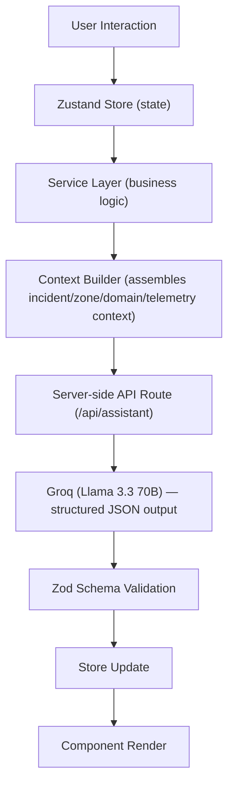
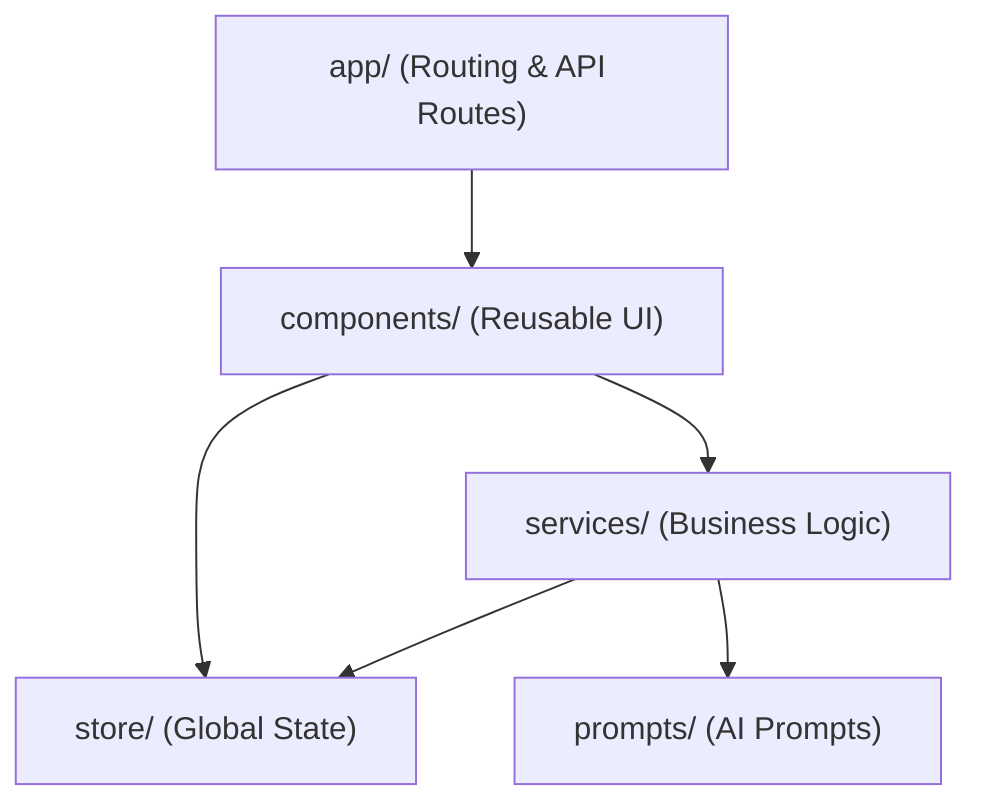

<div align="center">

# 🏟️ VenueMind AI

### AI-Powered Stadium Operations Command Center

**Built for the FIFA World Cup 2026 — Smart Stadiums & Tournament Operations Challenge**

_One AI reasoning engine. Every operational decision, in real time._

[](https://venue-mind-ai.vercel.app/)
[](https://nextjs.org)
[](https://www.typescriptlang.org)
[](https://groq.com)
[](https://github.com/pmndrs/zustand)
[](https://tailwindcss.com)
[](https://www.framer.com/motion/)
[](https://zod.dev)
[](https://vitest.dev)
[](https://lucide.dev)
[](#license)

[Live Demo](https://venue-mind-ai.vercel.app/) · [Features](#-key-features) · [Architecture](#-system-architecture) · [Getting Started](#-getting-started)

</div>

---

## 📖 Overview

VenueMind AI is a real-time operations intelligence platform built for the people who actually run a FIFA World Cup stadium — not the fans in the seats, but the operators watching the incident queue, the analysts triaging risk, the teams deciding what happens in the next five minutes.

Most hackathon submissions for this challenge default to a consumer-facing fan app. VenueMind AI deliberately does not. The challenge brief scopes the problem as _"fans, organizers, volunteers, **or** venue staff"_ — an _or_, not an _and_. VenueMind AI takes that seriously: one persona, one deep, production-quality product, rather than four shallow ones.

The result is a Digital Twin–centered command console where a live-simulated stadium feeds a real Groq/Llama-powered reasoning engine, and every operational surface — incident management, crowd/transport/emergency/accessibility monitoring, a full AI command center, and a historical operations log — shares that same underlying intelligence.

> **This is not a chatbot bolted onto a dashboard.** The AI is the decision-support layer running underneath the entire product.

---

## 🎯 The Problem

Running a World Cup stadium means absorbing a constant stream of operational signals — crowd density shifting at a gate, a medical call, a transport delay, an accessibility request — and making the right call fast, often with incomplete information, across multiple simultaneous domains.

Existing stadium tech is largely **monitoring-first**: dashboards that show data but don't reason about it. Very little of it is **decision-support-first** — actively interpreting a situation, predicting risk, and recommending a specific, justified next action.

## ✅ Our Solution

VenueMind AI closes that gap with a single, shared AI reasoning engine that:

- Interprets live (simulated) telemetry and incident data
- Predicts operational risk before it escalates
- Recommends specific, tactical responses with confidence scoring
- Explains _why_ — every AI output includes situation context, expected risk, and reasoning, never a black-box answer
- Feeds every action back into a persistent operational timeline, so nothing the AI or an operator does happens in isolation

### 🔄 Comparison Matrix

| ❌ What Others Build | ✅ What VenueMind AI Is |
| :--- | :--- |
| **Shallow multi-persona apps**<br>Defaulting to consumer-facing fan apps or trying to cover four personas shallowly. | **One deep, production-grade product**<br>Dedicated entirely to a single persona: stadium operators and venue staff. |
| **Monitoring-First Dashboards**<br>Interfaces that display raw data without reasoning or explaining the situation. | **Decision-Support-First Console**<br>Actively interprets telemetry, predicts risk, and recommends justified tactical actions. |
| **Bolted-On Chatbots**<br>Simple chat widgets floating on top of standard CRUD views. | **Underlying AI Reasoning Engine**<br>A shared decision-support layer integrated directly into every operational surface. |
| **Disconnected/Static Views**<br>Static mock data or isolated alerts that don't impact the rest of the application. | **Unified Operational Flow**<br>All simulated IoT telemetry and AI actions feed into a persistent global timeline. |

---

## ✨ Key Features

<table>
  <tr>
    <td width="50%" valign="top">
      <h3>🗺️ Interactive Stadium Digital Twin</h3>
      <p>A custom-built, layered React SVG stadium — not a generic map — with live incident markers, crowd density visualization, gate/route overlays, and zone-level drill-down, styled to feel like a genuine SOC/mission-control interface.</p>
    </td>
    <td width="50%" valign="top">
      <h3>🧠 AI Command Center</h3>
      <p>A dual-mode reasoning console: <strong>structured mode</strong> (select an incident, zone, or operational domain for a full AI briefing) and <strong>free-form mode</strong> (ask any operational question in natural language). Every response is schema-validated, confidence-scored, and dispatchable directly into the operations timeline. Powered by Groq running Llama 3.3 70B.</p>
    </td>
  </tr>
  <tr>
    <td width="50%" valign="top">
      <h3>🚨 Live Incident Management Console</h3>
      <p>A full incident command queue with multi-select bulk actions, AI-assisted consolidated briefings across multiple incidents, per-incident AI situation intelligence with tactical recommendations, and a complete inline lifecycle timeline per incident.</p>
    </td>
    <td width="50%" valign="top">
      <h3>🎯 Domain Intelligence Lens Pages</h3>
      <p>Dedicated operational views for <strong>Crowd Monitoring</strong>, <strong>Transport</strong>, <strong>Emergency</strong>, and <strong>Accessibility</strong> — each bound to live telemetry, each with a domain-scoped "Ask AI" console, and Accessibility additionally featuring a Tactical Accessibility Dispatch Tool that generates structured, step-by-step accommodation routing.</p>
    </td>
  </tr>
  <tr>
    <td width="50%" valign="top">
      <h3>🌐 Multilingual AI Output</h3>
      <p>AI-generated responses (situation summaries, tactical recommendations, dispatch briefings) can be returned in English, Spanish, French, Portuguese, or Hindi — critical for a tournament with multinational staff and volunteer teams.</p>
    </td>
    <td width="50%" valign="top">
      <h3>📋 Global Operations Timeline</h3>
      <p>A complete, phase-grouped chronological log of every detection, AI analysis, dispatch, and resolution across the session — the operational "flight recorder," with activity density visualization and full filtering.</p>
    </td>
  </tr>
  <tr>
    <td width="50%" valign="top">
      <h3>⚙️ Live Simulation Engine</h3>
      <p>A realistic, phase-driven match simulation (pre-match → first half → halftime → second half → post-match) generating live telemetry, incidents, weather, and crowd events — providing a fully functional, demonstrable environment without requiring real stadium IoT infrastructure.</p>
    </td>
    <td width="50%" valign="top">
    </td>
  </tr>
</table>

---

## 🏗️ System Architecture

VenueMind AI is built on strict separation of concerns, with one shared AI reasoning pipeline underneath every feature:



**Key architectural decisions:**

- **One AI brain, many entry points** — the Digital Twin's AI panel, the AI Command Center, every lens page's Domain Copilot, and Live Incidents' consolidated briefing all funnel through the same context builder and reasoning pipeline, not separate implementations.
- **No database** — the app is intentionally stateless and simulation-driven, with all "live" data coming from an in-memory simulation engine. This keeps the architecture small, auditable, and removes an entire class of security surface, while remaining structured to swap in real IoT/telemetry feeds without a rewrite.
- **Server-only AI calls** — the Groq API key is never exposed client-side; every AI request is proxied through a Next.js API route with input validation and schema-enforced output.
- **Type-safe throughout** — strict TypeScript, Zod validation on every AI response before it reaches the UI, with no `any` usage.

---

## 🧰 Technology Stack

| Layer                  | Technology                                                            |
| ---------------------- | --------------------------------------------------------------------- |
| Framework              | [Next.js 16](https://nextjs.org) (App Router)                         |
| Language               | TypeScript (strict mode)                                              |
| State Management       | [Zustand](https://github.com/pmndrs/zustand)                          |
| Styling                | [Tailwind CSS v4](https://tailwindcss.com) with CSS custom properties |
| Animation              | [Framer Motion](https://www.framer.com/motion/)                       |
| Digital Twin Rendering | Custom React SVG + `react-zoom-pan-pinch`                             |
| AI Inference           | [Groq](https://groq.com) — Llama 3.3 70B                              |
| Validation             | [Zod](https://zod.dev)                                                |
| Icons                  | [Lucide React](https://lucide.dev)                                    |
| Testing                | Vitest                                                                |
| Linting/Formatting     | ESLint, Prettier                                                      |
| Deployment             | Vercel                                                                |

---

## 📂 Project Structure

```text
src/
├── app/                      # Next.js routes (App Router)
│   ├── (marketing)/          # Landing page (no app shell)
│   ├── (app)/                # Operational console (AppShell-wrapped)
│   │   ├── dashboard/
│   │   ├── incidents/
│   │   ├── ai-command/
│   │   ├── map/
│   │   ├── crowd/ transport/ emergency/ accessibility/
│   │   ├── timeline/
│   │   └── settings/
│   └── api/assistant/        # Server-side Groq proxy route
├── components/
│   ├── digitalTwin/          # Stadium SVG, layers, panels
│   ├── incident/             # Incident table, drawer, timeline
│   ├── ai/                   # AI Command Center, response cards
│   ├── operations/           # Dashboard widgets
│   ├── layout/                # AppShell, sidebar, header, right panel
│   └── shared/                # Loading/Error/Empty states, UI primitives
├── services/
│   ├── ai/                    # Context builder, assistant service
│   └── simulation/            # Phase-driven scenario engine
├── store/modules/             # Zustand stores (incident, assistant, ui, digitalTwin)
├── prompts/                   # System prompt, persona prompt, templates
├── schemas/                   # Zod validation schemas
├── types/                     # Shared TypeScript types
├── constants/                 # Config, routes, mock data
docs/                          # Architecture, design, engineering, testing docs
```

### 🗺️ Structural Relationships



---

## 🎯 Challenge Alignment

The FIFA World Cup 2026 Smart Stadiums & Tournament Operations challenge scopes its target audience as _"fans, organizers, volunteers, or venue staff"_ — deliberately an inclusive **or**, not a requirement to cover all four.

**VenueMind AI targets venue staff and operations management, deliberately and entirely.** Rather than building shallow features across four personas, this project goes deep on one — because a stadium operations manager making a crowd-crush call in real time needs a fundamentally different tool than a fan looking for their seat.

Within that scope, VenueMind AI directly addresses:

| Challenge Pillar               | How VenueMind AI Addresses It                                                |
| ------------------------------ | ---------------------------------------------------------------------------- |
| **Operational Intelligence**   | AI Command Center, per-domain Copilots, incident situation intelligence      |
| **Real-Time Decision Support** | Structured AI briefings with confidence scoring and tactical recommendations |
| **Crowd Management**           | Digital Twin density visualization, Crowd Monitoring lens page               |
| **Accessibility**              | Tactical Accessibility Dispatch Tool with AI-generated routing               |
| **Multilingual Assistance**    | AI response language selector (EN/ES/FR/PT/HI)                               |
| **Transportation**             | Transport lens page with live transit telemetry and AI-scoped queries        |

---

## 🧭 Approach & Logic

The build followed a deliberate sequence, not a feature checklist:

1. **Scope the persona first.** Before any UI work, the challenge's "or" framing was treated as a real constraint, not a suggestion — venue staff/operations was chosen and every subsequent decision was filtered through "does this help an operator make a faster, better decision," not "does this look impressive."
2. **Architecture before features.** The AI reasoning pipeline (context builder → API route → Groq → Zod validation) was built once, correctly, before any UI consumed it — every feature that "asks the AI something" (Digital Twin panel, AI Command Center, lens page Copilots, Live Incidents' consolidated briefing) reuses that same pipeline rather than re-implementing AI calls per feature. This was a deliberate choice to keep the codebase coherent as features were added.
3. **Simulation as an honest substitute for real IoT.** Real stadium sensor/telemetry access isn't available in a hackathon context. Rather than faking realism, the simulation engine is treated as an explicit, labeled architectural layer — a genuine "digital twin" pattern already used in real stadium tech deployments — so it's technically honest about what's live (the AI) versus what's simulated (the data feeding it).
4. **Iterative UX hardening.** The product went through repeated rounds of functional and accessibility review — fixing real bugs (state desync between structured/free-form AI modes, malformed LLM output, layout overflow, keyboard traps) rather than shipping a first pass. The test suite and the Engineering Standards below reflect that process, not a one-off cleanup.

---

## ⚠️ Assumptions

- **Single-operator session.** No multi-user accounts or authentication exist; this is intentional, not an oversight — the product simulates one operator's console for demonstration purposes, and the architecture keeps auth out rather than faking it with no real backend behind it.
- **Simulated telemetry, real AI.** All stadium data (crowd density, incidents, transport status, weather, match state) is generated by an in-memory simulation engine, not real sensors. The AI reasoning layer (Groq/Llama 3.3 70B) is fully live and genuine.
- **English-first UI, multilingual AI output.** The application interface itself is in English; the multilingual capability applies specifically to AI-generated response content (situation summaries, recommendations), not full UI localization — this was a deliberate scope decision to prioritize AI-native multilingual reasoning over UI translation.
- **No persistent backend/database.** All state is in-memory (Zustand) and resets on a hard refresh by design, consistent with this being a stateless, simulation-driven demonstration rather than a production multi-session system.

---

## 🧪 Testing

The codebase includes a Vitest unit test suite covering pure business logic — not just UI smoke tests:

- AI context builder (per-mode context assembly: incident, zone, domain, multi-incident)
- Zod schema validation (valid/invalid AI response shapes)
- LLM response normalization (safe type coercion for malformed model output)
- Domain/incident filtering and table sort/filter utilities
- Store actions (bulk updates, per-incident note isolation)
- Shared utility functions (e.g. time formatting)

```bash
npm run test:run
```

---

## 🚀 Getting Started

### Prerequisites

- Node.js 18+
- A free [Groq API key](https://console.groq.com)

### Installation

```bash
# Clone the repository
git clone https://github.com/rahulasthwik1307/VenueMind-AI.git
cd VenueMind-AI

# Install dependencies
npm install

# Configure environment variables
cp .env.example .env.local
# then add your GROQ_API_KEY to .env.local

# Run the development server
npm run dev
```

Open [http://localhost:3000](http://localhost:3000) — you'll land on the landing page; click **Enter Command Center** to access the operations console.

### Verification

```bash
npm run lint      # ESLint — must pass with 0 warnings
npm run build      # Production build check
npm run test:run   # Vitest unit test suite
```

---

## 🌐 Live Demo

**[venue-mind-ai.vercel.app →](https://venue-mind-ai.vercel.app/)**

> All stadium telemetry, incidents, and match events are generated by a live simulation engine — this is intentional, not a limitation. AI reasoning (Groq/Llama 3.3 70B) is fully live and real; the underlying operational data is simulated to provide a complete, demonstrable environment without requiring real stadium IoT infrastructure. The architecture is designed to swap in live sensor/telemetry feeds without restructuring the application.

---

## ♿ Accessibility & Engineering Standards

- WCAG AA contrast throughout, both light and dark themes
- Full keyboard operability across every interactive surface (tables, dropdowns, dialogs, drawers)
- `aria-live` regions for dynamic AI response content
- `prefers-reduced-motion` respected across all animations
- Strict TypeScript, Zod-validated AI I/O, zero `console.log` in production paths
- Unit-tested business logic (context building, schema validation, filtering, store actions)

---

## 🔒 Security

VenueMind AI is designed with strict security boundaries to protect credentials and ensure data integrity:

| Security Domain | Implementation Details |
| :--- | :--- |
| **API Key Protection** | Groq API keys are handled server-side only. The client never accesses credentials directly; all requests are proxied via the Next.js `/api/assistant` endpoint. |
| **Environment Configuration** | Secrets are managed via local `.env.local` configuration, which is never committed to version control (`.gitignore` enforced). |
| **Input/Output Validation** | Zod schemas validate both input telemetry context and AI-generated outputs, preventing malformed payloads and injection risks. |
| **Schema Enforcement & Fallbacks** | AI outputs are strictly validated against TypeScript interfaces via Zod schemas, with a retry-then-typed-error fallback in place if outputs deviate. |
| **Stateless Architecture** | Operating without a database removes standard persistent data storage vulnerabilities. Telemetry and state are kept in-memory (Zustand). |

---

## 📐 Code Quality

The codebase enforces high engineering standards to maintain scalability, readability, and performance:

| Standard | Implementation & Enforcement |
| :--- | :--- |
| **Strict Type Safety** | Full TypeScript coverage with strict mode active and zero `any` types permitted. |
| **Linting & Formatting** | Automated ESLint and Prettier checks running on pre-commits and builds to ensure consistent style. |
| **Modular Architecture** | Clean separation of concerns with isolated component folders (`components/digitalTwin`, `components/incident`, `components/ai`), services, and stores. |
| **Stage 12 Code Refactor** | Enforced component size limits (target 100-180 lines, max 300 lines), consolidated duplicate code, and purged unused code. |
| **Vitest Test Suite** | Unit tests covering pure business logic: context building, schema validation, response normalization, and store actions. |

---

<div align="center">

**Built by [Rahul Asthwik](https://github.com/rahulasthwik1307)**

[GitHub](https://github.com/rahulasthwik1307) · [LinkedIn](https://www.linkedin.com/in/rahul-asthwik-sunki/)

_FIFA World Cup 2026 — Smart Stadiums & Tournament Operations Challenge_

---

**Built With**

[](https://nextjs.org)
[](https://www.typescriptlang.org)
[](https://groq.com)
[](https://github.com/pmndrs/zustand)
[](https://tailwindcss.com)
[](https://www.framer.com/motion/)
[](https://zod.dev)
[](https://vitest.dev)
[](https://lucide.dev)

</div>
